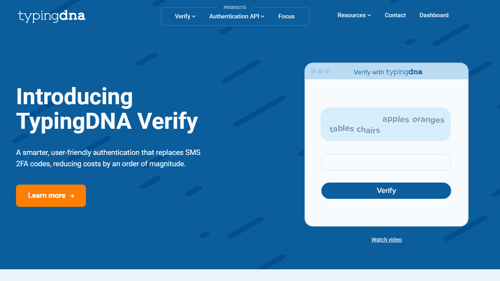
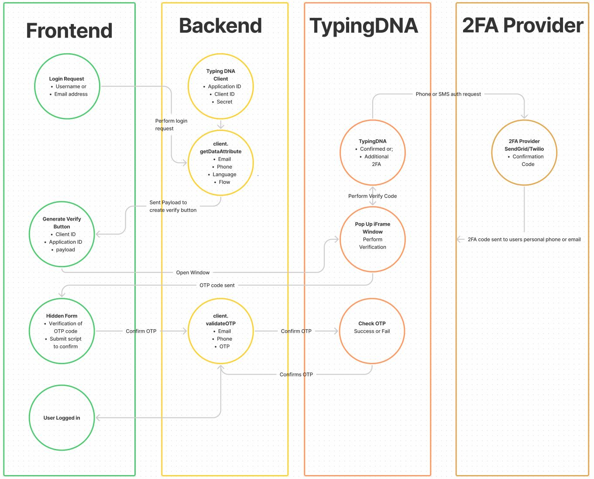

# TypingDNA Verify NodeJs Example

Setup your own instances of TypingDNA Verify using this example. Full documentation and signup can be found below:
https://www.typingdna.com/verify

## Developer
- Adrian Twarog

## Compatibility
- Latest versions of all modules and components as of 2021-06

## TypingDNA
- [TypingDNA](https://www.typingdna.com/) 

## Front End Dependencies
- [NodeJs](https://nodejs.org/en/download/) - Latest
- [TypingDna Verify Client](https://github.com/TypingDNA/TypingDNA-Verify-Client) - Client for NodeJs
- [Express](https://github.com/expressjs/express) - Web Server
- [Ngrok](https://ngrok.com/) - Dynamic Domain Name Generator

 
# Getting Started
1. Run `npm install`
2. Run `node index.js`

## Authentication Process
Here is a high level overview of how the process occurs:

